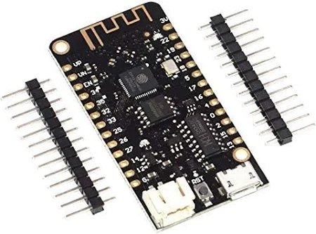

# Mailbox notifier with ESP32

- [Mailbox notifier with ESP32](#mailbox-notifier-with-esp32)
  - [Scope of Project](#scope-of-project)
  - [Implenmentation details](#implenmentation-details)
  - [Quickstart Guide](#quickstart-guide)
  - [References](#references)

## Scope of Project
The aim of this project is to provide a firmware for an ESP32, using Platform.IO, to:
* Put the ESP32 in deep-sleep
* Activate the the ESP32 based on a trigger, through a mechanical switch
* Connect to WiFi
* Send an E-Mail via SMTP
* and go back to deep-sleep

The idea is that I want to be notified if the mailman puts mail into my mailbox. The goal of this project is to use cost-effective, off-the-shelve components and provide the best battery-life possible. 

## Implenmentation details
The ESP32 variant that was used, is called LOLIN32 Lite, that can be had for about 5 to 10 euros on Amazon.

The firmware has been developed using [Platform.io](https://platformio.org/) and the implementation used the Arduino Framework. The exact configuration, including a list of libraries, can be found in the [platformio.ini](platformio.ini) file. 

The mechanical switch, that triggers a wake-up from deep sleep is configured on the GPIO 13. 

The environment variables are:

| **Variable Name** | **Purpose**                                                       |
| ----------------- | ----------------------------------------------------------------- |
| `WIFI_SSID`       | The SSID (name) of the WiFi network to connect to.                |
| `WIFI_PASSWORD`   | The password for the WiFi network.                                |
| `SMTP_HOST`       | The SMTP server address for sending emails.                       |
| `SMTP_PORT`       | The port used for connecting to the SMTP server.                  |
| `AUTHOR_EMAIL`    | The sender's email address.                                       |
| `AUTHOR_PASSWORD` | The sender's password for the sender's email account. |
| `RECIPIENT_EMAIL` | The recipient's email address for the notification.               |

En example file for the `.env.h` can be found under [`src/.env.template.h`](src/.env.template.h).

## Quickstart Guide
In order to start you need:
* Hardware
  * ESP32 with a mechanical switch connected to the RTC GPIO of your choice. Make sure that you add a 10k Ohm pull-down resistor. 
  * Battery Pack, usually a single-cell LiPO battery, but this depends on the battery-management that is on your ESP32
* Credentials: 
  * You have a SMTP mail server at your disposal. When you still need to create one, here is a [guide on how to do that with GMail](https://randomnerdtutorials.com/esp32-send-email-smtp-server-arduino-ide/).
  * WiFi Credentials for the location that you want to test this. 

If you have all of this you can follow the following steps:
* Create a copy of [`src/.env.template.h`](src/.env.template.h) and rename it to `src/.env.h`.
* Fill in the appropiate credentials
* Build the firmware using PlatformIO
* Upload and monitor the ESP32

## References
* https://randomnerdtutorials.com/esp32-send-email-smtp-server-arduino-ide/
* https://lastminuteengineers.com/esp32-deep-sleep-wakeup-sources/
* https://github.com/G6EJD/LiPo_Battery_Capacity_Estimator/blob/master/ReadBatteryCapacity_LIPO.ino